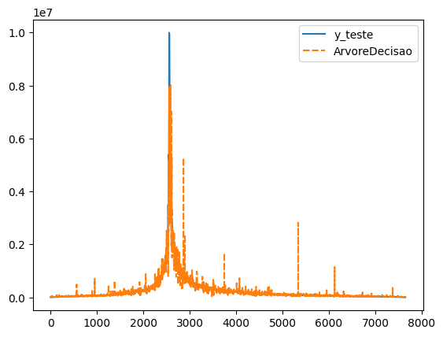

# Watercraft Values AI Prediction
 
This project's goal is to create an AI Model capable of predicting 
watercraft prices based on their composition material, width, length,
watercraft type (e.g. yatch, fishing boat), sell type (e.g. new boat, used boat),
and manufacture year using a database for the model training.

### Packages used:
+ sklearn
+ pandas
+ seaborn
+ matplotlib

## Importing the Database

First we need to import the database, which in this scenario is a .csv file
named "barcos_ref.csv". By using the DataFrame.info() method we can observe
that no data processing will be necessary in this case.

https://github.com/Hugo-Hattori/Watercraft_Values_AI_Prediction/blob/d26e1c7b50cf16faadfc915b3992396f913527f6/Watercraft_Values_AI_Prediction.py#L10-L15

## Exploratory Data Analysis (EDA)

Now we will analyze the correlation between the price and the other 
parameters such as length and composition material.

https://github.com/Hugo-Hattori/Watercraft_Values_AI_Prediction/blob/d26e1c7b50cf16faadfc915b3992396f913527f6/Watercraft_Values_AI_Prediction.py#L17-L21

## AI Modeling

In this scenario we will be using Linear Regression and Random Forest
Regressor as Machine Learning Algorithms, thus two models will be generated.

For the AI training process it is necessary to split the database
into x_treino, x_teste, y_treino, y_teste where "x" are the parameters
used to achieve the "y" which is the price. Both x_treino and y_treino
are going to be used for the AI training afterwards x_teste and y_teste
will both be used to test the AI Model's accuracy based on the R² Score.

https://github.com/Hugo-Hattori/Watercraft_Values_AI_Prediction/blob/d26e1c7b50cf16faadfc915b3992396f913527f6/Watercraft_Values_AI_Prediction.py#L23-L38

## Graphical Analysis

To make it more evident we will plot graphs that compare both the
Linear Regression and Random Forest Regressor models to "y_teste".

+ Linear Regression X y_teste

+ Random Forest Regressor X y_teste

## AI Prediction

The model with the highest score is the chosen one to predict
watercraft prices using a different database called "novos_barcos.csv"

https://github.com/Hugo-Hattori/Watercraft_Values_AI_Prediction/blob/d26e1c7b50cf16faadfc915b3992396f913527f6/Watercraft_Values_AI_Prediction.py#L54-L58

The "nova_previsao" variable contains the respective price values
predicted by the AI Model.

 Note: this is a project developed for academic purposes, therefore the
data contained in "barcos_ref.csv" and "novos_barcos.csv" are fictitious 
and used only to learn AI model training applications.
